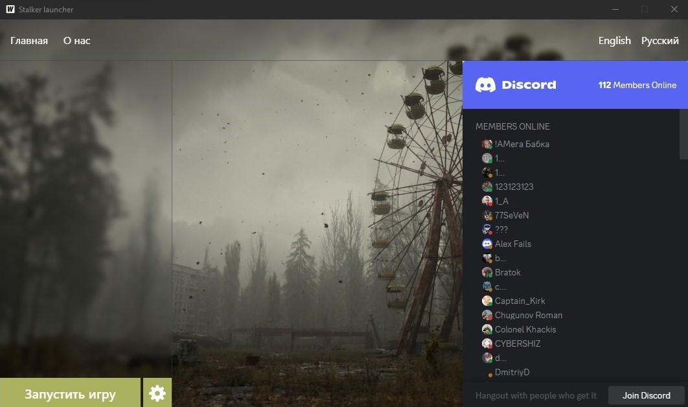

# Лаунчер для игры Stalker

## Возможности:
- Запуск игры
- Обновление клиента игры

## Сборка

### Установка зависимостей
- Установить Go https://go.dev/dl/
- Устанолвить Node (Нужен для сборки фронтенда лаунчера) https://nodejs.org/en 
- Установить wails (Технология на которой написан лаунчер) https://wails.io/docs/gettingstarted/installation
- Клонировать репозиторий: `$ https://github.com/kola24511/stalker-launcher.git`
- Перейти в каталог `cd stalker-launcher`

### Сборка сервера
- Скомпилировать серверную часть: `go build cmd/main.go`
- В папке с сервером нужно создать папку client где будут хранится файлы игрового клиента

### Сборка лаунчера
- Перейти в каталог лаунчера `cd launcher`
- Далее нужно перейти в каталог лаунчера `cd /frontend`
- Установка Node зависимостей `npm install`
- Возвращаемся на уровень выше `cd ..`
- Сборка лаунчера `wails build` после успешной сборки создается исполяемый файл в директории build/bin

## Запуск сервера
- Запустить сервер `./main` (Linux) или `./main.exe` (Windows)